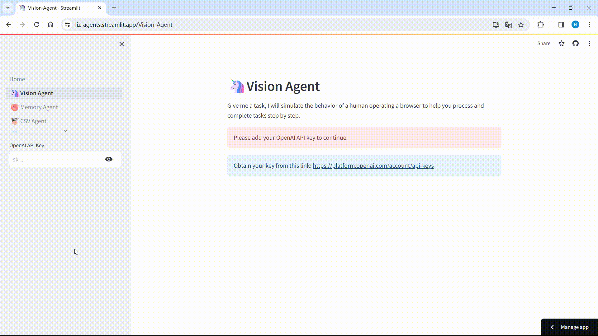
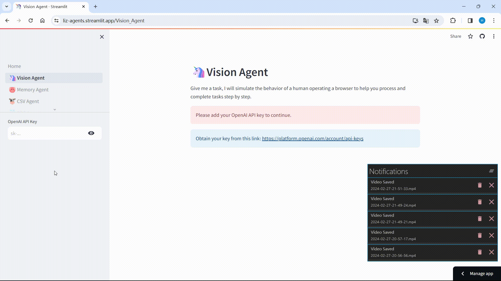
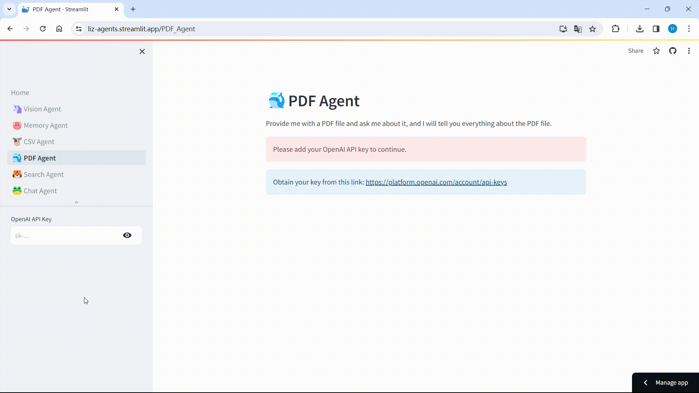

<div align="center"><h1>🌈LizAgents</h1></div>

## 🌷 Features
### 🦄Vision Agent
Give me a task, I will simulate the behavior of a human operating a browser to help you process and complete tasks step by step.





### 🐷Memory Agent
I am an intelligent agent with memory, let me help you handle complex tasks, or come to chat with me.


### 🐮CSV Agent
Provide me with a CSV file and ask me about it, and I will tell you everything about the CSV file.


### 🐳PDF Agent
Provide me with a PDF file and ask me about it, and I will tell you everything about the PDF file.



### 🐯Search Agent
I can search the internet for the latest information. What would you like to know? Let me help you.


### 🐸Chat Agent
I am a basic intelligent agent; ask me a question, and I will give you the answer.


## 🌞 Powered By
- [OpenAI](https://github.com/openai/openai-python)
- [LangChain](https://github.com/langchain-ai/langchain)
- [Streamlit](https://github.com/streamlit/streamlit)
- [Selenium](https://www.selenium.dev/)
- [GPT-4V-Act](https://github.com/ddupont808/GPT-4V-Act)

## 🏝️ Usage
```shell
pip install -r requirements.txt
```
```shell
streamlit run Home.py
```
## 💫 Contributions
Contributions, suggestions, bug reports and fixes are welcome!